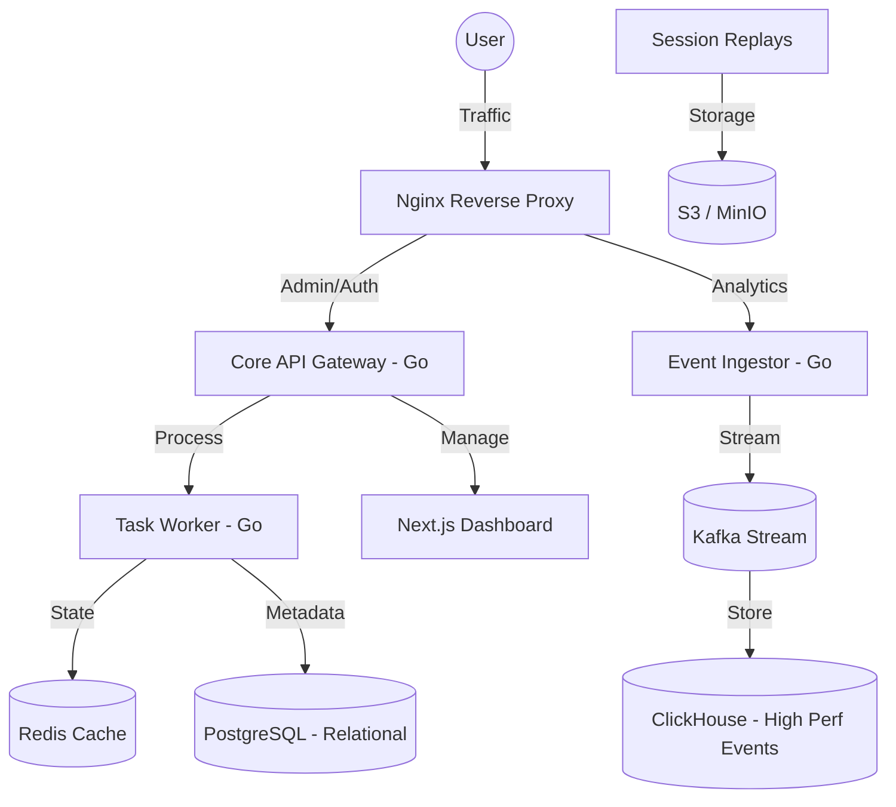

# Seentics 🚀

**Complete Open Source Websites Analytics and Automation Software.**

Seentics is a production-ready, high-performance analytics platform designed for speed, privacy, and scale. Inspired by industry leaders but built for absolute data ownership, Seentics combines behavioral insights with a powerful automation engine to help you grow your business.

[](LICENSE)
[](https://golang.org)
[](https://nextjs.org)
[](https://www.docker.com)

---

## 🌟 Why Seentics?

- **Complete Ownership**: 100% open-source. Your data, your servers, your rules.
- **Privacy First**: Fully GDPR/CCPA compliant by design. No cookie banners required for basic tracking.
- **Hybrid Storage**: PostgreSQL for relational data and ClickHouse for high-performance, large-scale event analytics.
- **Real-Time Pipeline**: Powered by Kafka and Redis for sub-second ingestion and instant dashboard updates.
- **Beyond Analytics**: Don't just watch data—act on it with built-in behavioral automations.

---

## ✨ Core Features

### 📊 Real-Time Analytics
- **Live Event Stream**: Track visitors, page views, and custom events as they happen.
- **Deep Insights**: Breakdown by geography, technology, referrers, and UTM parameters.
- **Hybrid Engine**: Optimized for small sites and massive enterprises alike.

### 🔥 Behavior Tracking
- **Interactive Heatmaps**: Visual overlays of user clicks, moves, and scrolling patterns.
- **Session Replays**: Play back user journeys to identify friction points (webcam-free and privacy-protected).
- **Funnels**: Visualize drop-off rates and optimize conversion paths.

### 🤖 Automation & Engagement
- **Dynamic Logic**: Trigger UI changes, popups, or emails based on real-time behavior.
- **No-Code Workflows**: Set up triggers like "Exit Intent" or "Time on Page" in seconds.

---

## 🏗️ Architecture

Seentics uses a modern, distributed architecture to ensure reliability and performance under heavy load.



---

## 🛠️ Tech Stack

- **Backend**: Go 1.24+ (Gin, SQLx, Kafka-Go)
- **Frontend**: Next.js 14, Tailwind CSS, Framer Motion, shadcn/ui
- **Event Store**: ClickHouse (for high-volume analytics)
- **Metadata Store**: PostgreSQL 15+
- **Stream Processing**: Apache Kafka
- **Cache**: Redis 7
- **Object Storage**: S3-Compatible (MinIO for local dev)

---

## 🚀 Local Development

Get Seentics running on your machine in under 5 minutes.

### 1. Prerequisites
- [Docker & Docker Desktop](https://www.docker.com/products/docker-desktop/)
- At least 8GB RAM allocated to Docker

### 2. Setup
```bash
git clone https://github.com/Seentics/seentics.git
cd seentics

# Copy environment examples
cp core/.env.example core/.env
```

### 3. Launch
```bash
docker-compose up --build
```

### 4. Access
- **Dashboard**: [http://localhost:3000](http://localhost:3000)
- **API**: [http://localhost:3002](http://localhost:3002)

---

## � Production Deployment

For production, we provide a dedicated setup in the `deploy/` directory that includes Nginx configuration and automatic SSL.

See [DEPLOYMENT.md](DEPLOYMENT.md) for full instructions on deploying to AWS/DigitalOcean.

---

## 🤝 Contributing & Community

Seentics is built by the community. Join us!

- **GitHub**: [Seentics/seentics](https://github.com/Seentics/seentics)
- Check out our [Roadmap](ROADMAP.md) for upcoming features.
- Follow [CONTRIBUTING.md](CONTRIBUTING.md) to start coding.

---

## 📄 License
Licensed under AGPL v3.0. See [LICENSE](LICENSE) for details.

Built with ❤️ by the Seentics community.
