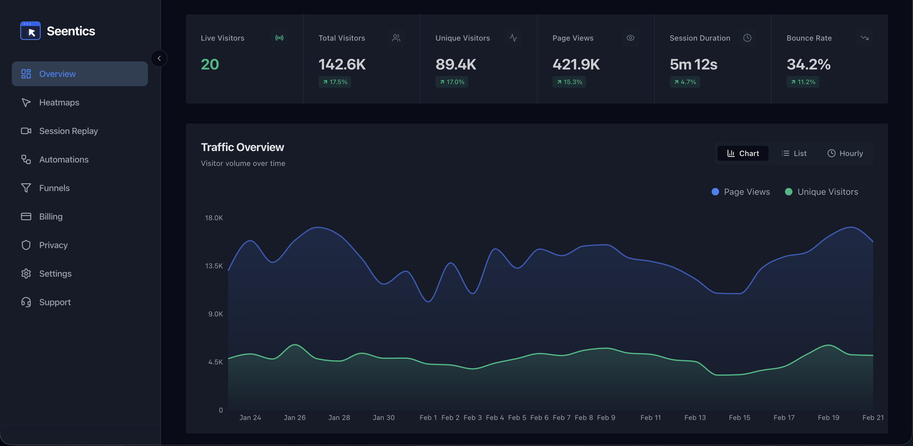

<p align="center">
  
</p>

<h1 align="center">Seentics</h1>

<p align="center">
  Open-source analytics platform with heatmaps, session replays, funnels, and behavioral automation.
  <br />
  <strong>Own your data. Understand your users. Automate what matters.</strong>
</p>

<p align="center">
  <a href="#quick-start">Quick Start</a> &middot;
  <a href="#features">Features</a> &middot;
  <a href="#tech-stack">Tech Stack</a> &middot;
  <a href="DEPLOYMENT.md">Deploy</a> &middot;
  <a href="ROADMAP.md">Roadmap</a> &middot;
  <a href="CONTRIBUTING.md">Contribute</a>
</p>

<p align="center">
  <a href="LICENSE"></a>
  <a href="https://golang.org"></a>
  <a href="https://nextjs.org"></a>
  <a href="https://www.docker.com"></a>
</p>

---

<p align="center">
  
</p>

## Why Seentics?

Most analytics tools either lock your data in a SaaS or give you charts with no way to act on them. Seentics does both — deep behavioral insights plus automation — and you keep every byte of data on your own infrastructure.

- **Self-hosted** — No third-party data sharing, no cookie banners needed
- **Privacy-first** — GDPR/CCPA compliant by design
- **Scales with you** — ClickHouse for analytics, PostgreSQL for metadata, NATS for streaming
- **Actionable** — Trigger popups, banners, and workflows based on real-time behavior

## Features

**Analytics** — Real-time dashboard, live visitors, traffic sources, geo breakdown, UTM tracking, custom events, data export

**Heatmaps** — Click maps, scroll depth, pointer tracking across every page

**Session Replays** — Full recordings with automatic PII masking, stored in S3-compatible storage

**Funnels** — Multi-step conversion tracking with drop-off analysis

**Automation** — Visual workflow builder for behavioral triggers — show popups, redirect users, fire webhooks, all based on what visitors actually do

## Quick Start

```bash
# Clone
git clone https://github.com/Seentics/seentics.git
cd seentics

# Configure
cp core/.env.example core/.env

# Launch (all services: backend, frontend, databases)
docker compose up --build
```

Open [localhost:3000](http://localhost:3000) — create your first site and start tracking.

## Architecture

```
[Browser] --> [Next.js Frontend :3000]
                    |
              [Go Backend :3002]
                    |
    +-----------+---+---+---------+-------+
    |           |       |         |       |
 Postgres  ClickHouse  Redis    NATS   MinIO
 (metadata) (events)  (cache) (stream) (replays)
```

**Single binary backend** — the Go service handles auth, events, heatmaps, replays, funnels, automations, and the tracker config API. Events flow through NATS for async processing, get batched, and land in ClickHouse (with PostgreSQL fallback).

## Tech Stack

| Layer | Technology |
|-------|-----------|
| Backend | Go 1.24, Gin framework |
| Frontend | Next.js 14, Tailwind CSS, shadcn/ui |
| Analytics DB | ClickHouse |
| Metadata DB | PostgreSQL 15 |
| Streaming | NATS JetStream |
| Cache | Redis 7 |
| Object Storage | S3-compatible (MinIO for local) |
| Container | Docker Compose |

## Project Structure

```
seentics/
├── core/                  # Go backend
│   ├── cmd/api/           # Entry point
│   ├── internal/
│   │   ├── modules/       # analytics, auth, automations, funnels,
│   │   │                  # heatmaps, replays, websites
│   │   └── shared/        # config, database, middleware, nats, storage
│   ├── Dockerfile
│   └── Dockerfile.dev
├── web/                   # Next.js frontend
│   ├── src/
│   │   ├── app/           # App router pages
│   │   ├── components/    # UI components
│   │   └── lib/           # API clients, hooks, utils
│   ├── Dockerfile
│   └── Dockerfile.dev
└── docker-compose.yml     # Full stack for local development
```

## Configuration

Copy `core/.env.example` to `core/.env` and adjust as needed:

| Variable | Default | Description |
|----------|---------|-------------|
| `PORT` | `3002` | Backend API port |
| `DATABASE_URL` | — | PostgreSQL connection string |
| `REDIS_URL` | — | Redis connection string |
| `NATS_URL` | `nats://localhost:4222` | NATS server URL |
| `JWT_SECRET` | — | Secret for JWT signing (min 32 chars in prod) |
| `CLICKHOUSE_HOST` | `localhost` | ClickHouse host |
| `S3_ENDPOINT` | `http://minio:9000` | S3-compatible storage for replays |

## Production Deployment

See [DEPLOYMENT.md](DEPLOYMENT.md) for the full guide with Nginx, SSL, and recommended server specs.

```bash
# Quick deploy with Docker Compose
docker compose -f docker-compose.yml up -d --build
```

## Contributing

We welcome contributions of all kinds. See [CONTRIBUTING.md](CONTRIBUTING.md) to get started.

1. Fork the repo
2. Create a feature branch (`git checkout -b feature/your-feature`)
3. Commit your changes
4. Open a pull request

## License

AGPL v3.0 — See [LICENSE](LICENSE) for details.

You can use Seentics freely for any purpose. If you modify the source and offer it as a service, you must open-source your changes.

---

<p align="center">
  Built by the <a href="https://github.com/Seentics">Seentics</a> community
</p>
