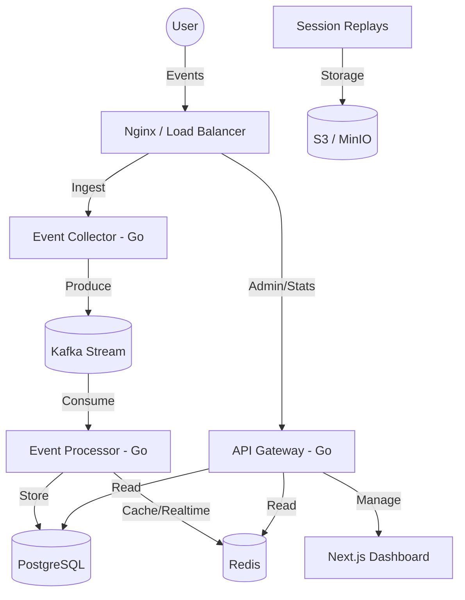

# Seentics Analytics 🚀

**The open-source, high-performance alternative to Google Analytics.**  
Seentics is a production-ready analytics platform designed for speed, privacy, and scale. Built with a modern distributed architecture, it provides deep behavioral insights without sacrificing data ownership.

[](LICENSE)
[](https://golang.org)
[](https://nextjs.org)
[](https://www.docker.com)

---

## 🌟 Why Seentics?

- **Zero Limits**: No caps on websites, events, or users. You scale with your infrastructure.
- **Privacy First**: 100% GDPR/CCPA compliant. Data never leaves your servers.
- **High Performance**: Sub-second event ingestion and real-time dashboard updates.
- **Actionable Intelligence**: Built-in automation engine to trigger UI changes based on user behavior.
- **Advanced Visualization**: Heatmaps and Session Replays included out of the box.

---

## ✨ Core Features

### 📊 Real-Time Analytics
- **Live Ingestion**: Powered by Kafka for reliable, high-throughput event processing.
- **Visitor Insights**: Real-time breakdown of geography, devices, browsers, and OS.
- **Custom Events**: Track any user action with simple API calls or the auto-tracker.

### 🔥 Heatmaps & Behavior
- **Visual Mapping**: See where users click, move, and scroll with high-fidelity heatmaps.
- **Page Analysis**: Identify friction points on specific pages using visual overlays.

### 🎥 Session Replays
- **Chrono-Logs**: Record and play back entire user sessions to understand their journey.
- **Privacy Controls**: Automatically mask sensitive input data during recording.

### 🤖 Automation Engine
- **Behavioral Triggers**: Trigger modals, banners, or webhooks based on time on site, scroll depth, or page flow.
- **Visual Workflow**: Design automated interactions without writing code.

---

## 🏗️ Architecture Overview

Seentics is built to handle massive traffic spikes using a distributed system of specialized services.



---

## 🛠️ Tech Stack

- **Backend**: Go (Golang) 1.23+ with Gin
- **Frontend**: Next.js 15, Tailwind CSS, TanStack Query, shadcn/ui
- **Data Stream**: Apache Kafka (KRaft mode)
- **Primary DB**: PostgreSQL 15+
- **Cache/Queue**: Redis 7
- **Object Storage**: MinIO (S3 Compatible) for replays
- **Deployment**: Docker & Docker Compose

---

## 🚀 Quick Start

### 1. Prerequisites
- [Docker](https://docs.docker.com/get-docker/) & Docker Compose
- [Node.js](https://nodejs.org/) 20+ (optional, for local frontend dev)
- [Go](https://go.dev/) 1.23+ (optional, for local backend dev)

### 2. Clone & Setup
```bash
git clone https://github.com/skshohagmiah/seentics-analytics.git
cd seentics-analytics

# Setup environment variables
cp .env.example .env
cp web/.env.example web/.env.local
```

### 3. Launch Stack
```bash
# Start all services (Backend, Frontend, Postgres, Kafka, Redis, MinIO)
./run.sh
```

### 4. Access
- **Dashboard**: [http://localhost:3000](http://localhost:3000)
- **API Health**: [http://localhost:3002/health](http://localhost:3002/health)

---

## 🛡️ Security & Privacy
Seentics is designed to be self-hosted, ensuring you have absolute control over your tracking data.
- **Anonymization**: IP addresses are anonymized by default.
- **Zero Third-Party**: No data is shared with external services.
- **Encryption**: TLS support for all data in transit.

---

## 🤝 Contributing
We love contributions! Whether it's adding a new feature, fixing a bug, or improving documentation, please read our [CONTRIBUTING.md](CONTRIBUTING.md) to get started.

## 📄 License
This project is licensed under the GNU Affero General Public License v3.0 - see the [LICENSE](LICENSE) file for details.

---

Built with ❤️ by [skshohagmiah](https://github.com/skshohagmiah) and the open-source community.
