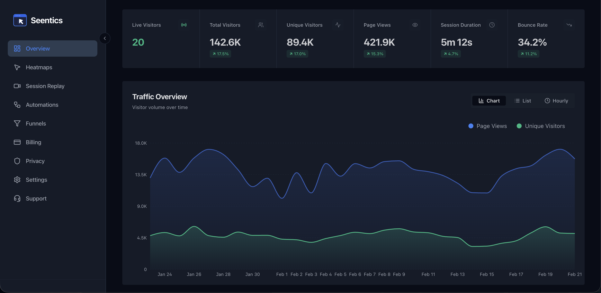

<p align="center">
  
</p>

<h1 align="center">Seentics</h1>

<p align="center">
  Open-source, privacy-first web analytics with heatmaps, session replays, funnels, and behavioral automations.
</p>

<p align="center">
  <a href="#quick-start">Quick Start</a> ·
  <a href="#features">Features</a> ·
  <a href="#self-hosting">Self-Hosting</a> ·
  <a href="CONTRIBUTING.md">Contributing</a> ·
  <a href="DEPLOYMENT.md">Deploy to Production</a>
</p>

<p align="center">
  <a href="LICENSE"></a>
  
  
  
  
</p>

<br />

<p align="center">
  
</p>

---

## What is Seentics?

Seentics is a self-hosted web analytics platform that goes beyond page views. It gives you real-time traffic data, visual heatmaps, full session replays, conversion funnels, and the ability to trigger automations based on visitor behavior — all without cookies or fingerprinting.

You own your data. Deploy it on your own server in minutes with Docker.

---

## Features

**Real-time Analytics** — Live visitors, page views, bounce rate, session duration, traffic sources, devices, browsers, countries, and more. Filter by any date range.

**Heatmaps** — See where users click and how far they scroll. Supports desktop, tablet, and mobile viewports. Works on any page without code changes.

**Session Replays** — Watch full session recordings to understand user behavior, find bugs, and improve UX. Stored in S3-compatible storage with automatic PII masking.

**Funnels** — Build multi-step conversion funnels to see exactly where users drop off in your signup, checkout, or onboarding flow.

**Goal Tracking** — Track custom events and page visit goals. Auto-track clicks on CSS selectors or fire events manually with `seentics.track('event_name')`.

**Behavioral Automations** — Trigger popups, banners, webhooks, or custom JavaScript based on real-time visitor behavior like exit intent, scroll depth, or time on page.

**Privacy First** — No cookies. No fingerprinting. No PII collection. GDPR and PECR compliant by design.

---

## Tech Stack

| Layer | Technology |
|-------|-----------|
| Backend API | Go 1.24 (Gin) |
| Frontend | Next.js 14, Tailwind CSS, shadcn/ui |
| Analytics DB | ClickHouse |
| Metadata DB | PostgreSQL 15 |
| Object Storage | S3-compatible (MinIO for local dev) |
| Caching | [CacheGrid](https://github.com/skshohagmiah/cachegrid) (embedded Go cache) |

---

## Quick Start

Requirements: [Docker](https://www.docker.com/) and [Docker Compose](https://docs.docker.com/compose/).

```bash
git clone https://github.com/Seentics/seentics.git
cd seentics

# Start everything
docker compose up -d --build
```

That's it. Open [http://localhost:3000](http://localhost:3000) to access the dashboard.

The API runs at [http://localhost:3002](http://localhost:3002).

---

## Add the Tracking Script

After creating a website in the dashboard, add this to your site's `<head>`:

```html
<script
  async
  src="http://localhost:3002/trackers/seentics-core.js"
  data-site-id="YOUR_SITE_ID"
></script>
```

Replace `localhost:3002` with your server's URL in production.

### Track Custom Events

```javascript
// Basic event
seentics.track('signup_click')

// With properties
seentics.track('purchase', { value: 49.99, plan: 'pro' })
```

### Goal Tracking

Create goals in **Settings > Goals** to track conversions:

- **Page visit goals** — automatically tracked when a visitor hits a specific URL path (e.g. `/thank-you`)
- **Custom event goals** — tracked when your code calls `seentics.track('event_name')`
- **CSS selector goals** — auto-tracked when a visitor clicks a matching element (e.g. `#signup-btn`, `.cta-button`)

---

## Project Structure

```
seentics/
├── core/                   # Go backend API
│   ├── cmd/api/            # Entry point
│   ├── internal/
│   │   ├── modules/        # Analytics, heatmaps, replays, funnels, automations
│   │   └── shared/         # Database, config, middleware
│   └── data/trackers/      # Tracking scripts served to sites
├── web/                    # Next.js frontend
│   ├── src/app/            # Pages (App Router)
│   ├── src/components/     # UI components
│   └── src/lib/            # API clients, utilities
├── docker-compose.yml      # Local development stack
└── scripts/                # Deployment & utility scripts
```

---

## Self-Hosting

### Local Development

```bash
docker compose up -d --build
```

This starts PostgreSQL, ClickHouse, MinIO, and both the backend and frontend in development mode with hot reloading.

### Production

See the full [Deployment Guide](DEPLOYMENT.md) for step-by-step instructions on deploying to AWS EC2 (or any Linux server) with Docker, Nginx, and SSL.

Quick overview:

```bash
# On your server
git clone https://github.com/Seentics/seentics.git
cd seentics
cp core/.env.example core/.env   # Edit with your production values
./scripts/deploy.sh
```

### Environment Variables

| Variable | Description | Default |
|----------|-------------|---------|
| `DATABASE_URL` | PostgreSQL connection string | See `.env.example` |
| `JWT_SECRET` | Secret key for auth tokens | Required |
| `CLICKHOUSE_HOST` | ClickHouse server address | `localhost` |
| `CLICKHOUSE_DB` | ClickHouse database name | `seentics` |
| `S3_ENDPOINT` | S3/MinIO endpoint for replays | `http://minio:9000` |
| `CORS_ALLOWED_ORIGINS` | Allowed frontend origins | `http://localhost:3000` |

See [`core/.env.example`](core/.env.example) for the full list.

---

## Architecture

```
Browser ──→ Next.js Frontend (:3000)
                  │
            Go Backend API (:3002)
                  │
    ┌─────────────┼─────────────┐
    │             │             │
ClickHouse    PostgreSQL     MinIO
 (events)     (metadata)   (replays)
```

The tracking script (`seentics-core.js`) is served by the Go backend and sends events directly to it. The backend processes events into ClickHouse for analytics queries, stores session replay data in S3-compatible storage, and uses PostgreSQL for user accounts, website configs, goals, and automation rules.

---

## Contributing

We welcome all contributions — bug reports, feature requests, docs improvements, and code.

1. Fork the repo
2. Create a branch: `git checkout -b my-feature`
3. Make your changes
4. Submit a pull request

See [CONTRIBUTING.md](CONTRIBUTING.md) for detailed development setup instructions.

## License

Seentics is licensed under [AGPL v3.0](LICENSE). You can self-host it freely. If you modify and distribute the software, your changes must be open-sourced under the same license.

---

<p align="center">
  Built by the <a href="https://github.com/Seentics">Seentics</a> team
</p>
