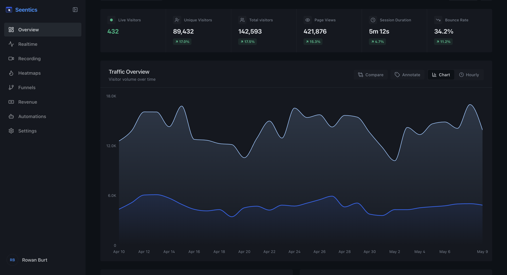
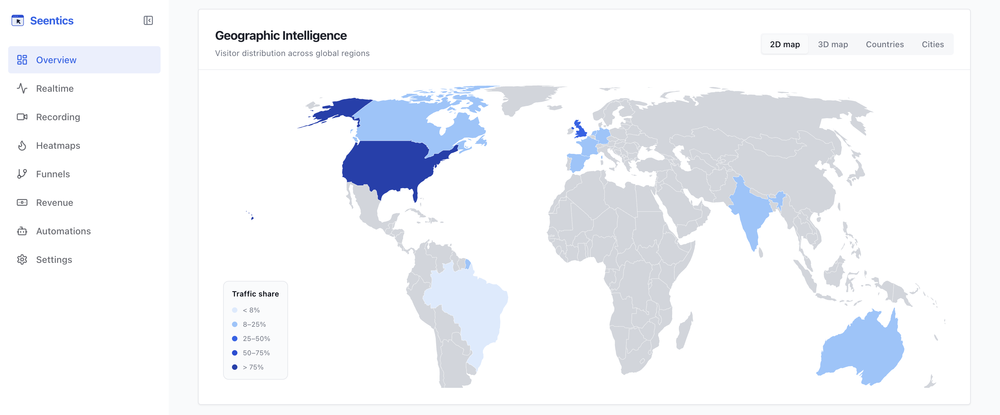
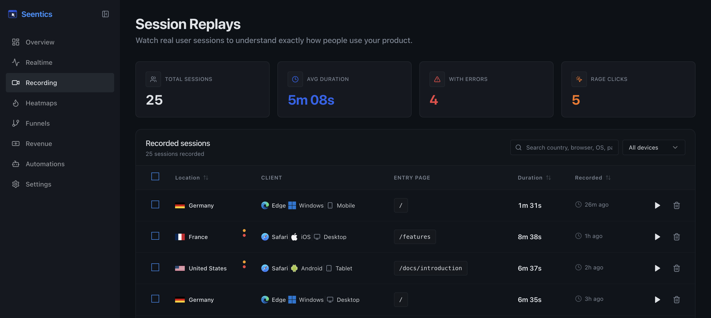
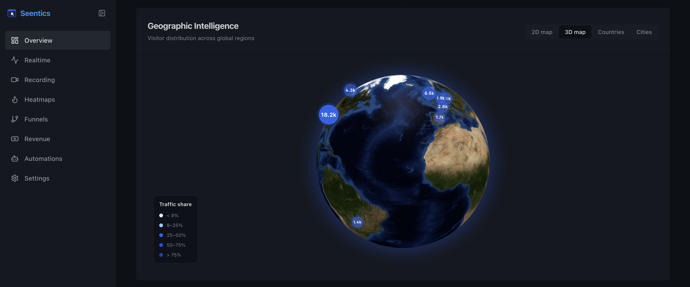

<p align="center">
  
</p>

<h1 align="center">Seentics</h1>

<p align="center">
  Open-source, privacy-first web analytics platform — featuring real-time dashboards, session replays,<br />
  heatmaps, funnels, revenue tracking, behavioral automations, and AI-powered natural language queries.
</p>

<p align="center">
  <a href="#-quick-start">Quick Start</a> ·
  <a href="#-features">Features</a> ·
  <a href="#-tracking">Tracking</a> ·
  <a href="#-self-hosting">Self-Hosting</a> ·
  <a href="#-contributing">Contributing</a>
</p>

<p align="center">
  <a href="LICENSE"></a>
  
  
  
  
  
  
</p>

<br />

<table>
  <tr>
    <td width="50%">
      
    </td>
    <td width="50%">
      
    </td>
  </tr>
  <tr>
    <td width="50%">
      
    </td>
    <td width="50%">
      
    </td>
  </tr>
</table>

---

## What is Seentics?

Seentics is a fully self-hosted analytics platform. It gives you everything you need to understand your visitors and improve your product — without cookies, fingerprinting, or sharing data with third parties.

You own your data. It runs on your infrastructure. Deploy in minutes with Docker.

---

## ✨ Features

- **Seentics AI** — ask anything about your data in plain English; AI generates SQL and renders charts across analytics, revenue, replays, heatmaps, funnels, and automations (`⌘K`)
- **Real-time analytics** — live visitor map, active pages, and traffic as it happens
- **Session replays** — watch full recordings with rage-click and JS error detection
- **Heatmaps** — click maps, scroll depth, and captured page screenshots
- **Funnels** — multi-step conversion analysis with drop-off rates
- **Revenue tracking** — orders, AOV, ARPU, and UTM channel attribution
- **Custom events** — track any action with typed properties and filtering
- **Goals** — page visit, custom event, or CSS selector click conversions
- **Behavioral automations** — trigger webhooks or emails based on visitor actions
- **Path analysis** — visualize how users move between pages
- **Privacy-first** — no cookies, no fingerprinting, fully self-hosted

---

## 🛠 Tech Stack

| Layer | Technology |
|---|---|
| Backend API | Bun · Hono · Drizzle ORM (TypeScript) |
| Frontend | Next.js 15 · Tailwind CSS · shadcn/ui |
| Database | PostgreSQL 16 |
| Object Storage | S3-compatible (MinIO in Docker Compose) |
| Session Replays | rrweb |

---

## 🚀 Quick Start

**Requirements:** [Docker](https://www.docker.com/) and [Docker Compose](https://docs.docker.com/compose/)

```bash
git clone https://github.com/Seentics/seentics.git
cd seentics
docker compose up -d --build
```

Open **[http://localhost:3000](http://localhost:3000)** to access the dashboard.  
The API is available at **[http://localhost:8080/api/v1](http://localhost:8080/api/v1)**.

---

## 📡 Tracking

### Add the Script

After creating a website in the dashboard, add to your `<head>`:

```html
<script
  defer
  src="https://your-seentics-domain.com/trackers/seentics.js"
  data-website-id="YOUR_WEBSITE_ID"
></script>
```

Pageviews are tracked automatically. The website ID is the UUID shown in your dashboard.

### Custom Events

```javascript
// Simple event
seentics.track('signup_click')

// Event with properties
seentics.track('purchase', {
  value:    49.99,
  currency: 'USD',
  order_id: 'ORD-1234',
  plan:     'pro',
})

// Identify a user (optional)
seentics.identify({ email: 'user@example.com', plan: 'pro' })
```

### Revenue Tracking

Call `seentics.track('purchase', { ... })` on your checkout confirmation page:

```javascript
seentics.track('purchase', {
  value:        99.00,
  currency:     'USD',
  order_id:     'ORD-5678',   // used for deduplication
  product_name: 'Pro Plan',   // shows in Product breakdown
  user_type:    'new',        // 'new' | 'returning'
})
```

Attribution is resolved automatically from the visitor's session UTM parameters using last-non-direct touch.

### Goal Tracking

Create goals in **Settings → Goals**:

| Type | How it fires |
|---|---|
| Page visit | Visitor hits a URL path (e.g. `/thank-you`) |
| Custom event | Your code calls `seentics.track('event_name')` |
| CSS selector | Visitor clicks a matching element (e.g. `#signup-btn`) |

---

## 🗂 Project Structure

```
seentics/
├── core/                   # Bun + Hono API — analytics ingest, replays, heatmaps
│   ├── routes/             # API route handlers
│   ├── services/           # Business logic
│   ├── lib/                # Shared utilities
│   └── db/                 # Drizzle schema + migrations
│
├── web/                    # Next.js dashboard
│   ├── public/
│   │   └── trackers/       # seentics.js tracker script
│   └── src/
│       ├── app/
│       │   └── websites/[websiteId]/
│       │       ├── page.tsx         # Analytics overview
│       │       ├── realtime/        # Live dashboard
│       │       ├── heatmaps/        # Heatmaps
│       │       ├── replays/         # Session replays
│       │       ├── funnels/         # Funnels
│       │       ├── revenue/         # Revenue & orders
│       │       ├── events/          # Custom events
│       │       ├── paths/           # Path analysis
│       │       ├── automations/     # Behavioral automations
│       │       └── settings/        # Goals, team, API keys, alerts
│       ├── components/     # Reusable UI components
│       ├── lib/            # API clients
│       └── hooks/          # Custom React hooks
│
├── packages/
│   └── components/         # @seentics/components — embeddable React charts (MIT)
│
└── docker-compose.yml
```

---

## 🏠 Self-Hosting

### Local Development

```bash
docker compose up -d --build
```

Starts PostgreSQL, MinIO, the Bun API, and the Next.js app with hot reload.

### Production

Copy and configure the environment variables, then run behind a reverse proxy (nginx, Caddy, Traefik) with HTTPS.

```bash
cp .env.example .env
# Edit .env with your values
docker compose -f docker-compose.prod.yml up -d --build
```

See [DEPLOYMENT.md](DEPLOYMENT.md) for a full production setup guide.

### Environment Variables

| Variable | Description |
|---|---|
| `DATABASE_URL` | PostgreSQL connection string |
| `JWT_SECRET` | Secret key for session tokens |
| `GLOBAL_API_KEY` | Internal service-to-service auth key |
| `S3_ENDPOINT` | S3-compatible endpoint (MinIO URL in Docker) |
| `S3_BUCKET` | Bucket name for replay and heatmap storage |
| `S3_ACCESS_KEY` / `S3_SECRET_KEY` | S3 credentials |
| `S3_PUBLIC` | Public base URL for presigned asset access |
| `CORS_ALLOWED_ORIGINS` | Comma-separated browser origins allowed to call the API |
| `TRUST_PROXY` | Set `true` when behind a reverse proxy to trust forwarded IP headers |
| `ENVIRONMENT` | `production` \| `development` |

---

## 🏗 Architecture

```
Browser / App
     │
     ├─ Dashboard ──▶ Next.js :3000
     │                     │
     └─ Tracker ───────────┤
                           ▼
                    Bun API :8080
                    /api/v1/...
                       │       │
                  PostgreSQL  MinIO (S3)
               (events, meta) (replays, heatmaps)
```

The tracker and dashboard both talk to the **`core`** API. Analytics events and metadata are stored in **PostgreSQL**. Session replay chunks and heatmap screenshots are stored in **S3-compatible** object storage.

---

## 🤝 Contributing

Contributions are welcome — bug reports, feature requests, docs improvements, and pull requests.

1. Fork the repository
2. Create a feature branch: `git checkout -b feat/my-feature`
3. Commit your changes: `git commit -m 'feat: add my feature'`
4. Push and open a pull request

Please open an issue first for significant changes so we can discuss the approach.

---

## 📄 License

Seentics is licensed under the [GNU AGPL v3.0](LICENSE).  
You may self-host freely. Any modifications must be released under the same license.

The `@seentics/components` package is separately licensed under the [MIT License](packages/components/LICENSE).

---

<p align="center">
  Built by the <a href="https://github.com/Seentics">Seentics</a> team · <a href="https://github.com/Seentics/seentics/issues">Report an issue</a>
</p>
